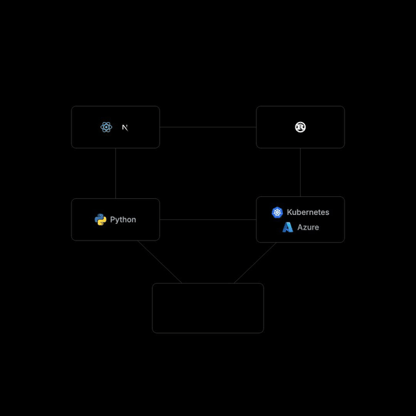

<p align="center">
  
</p>

<h1 align="center">showrunner</h1>

<p align="center">
  A motion design system for AI-generated video.<br/>
  Describe a video in a brief. Claude Code builds it in <a href="https://remotion.dev">Remotion</a> to a standard you would ship.
</p>

<p align="center">
  <a href="docs/media/shortform-openai-postgres.mp4">Watch the full 90-second example</a> ·
  <a href="docs/VIDEO_BRIEF_TEMPLATE.md">The brief template</a> ·
  <a href="docs/briefs/shortform-openai-postgres.md">A completed brief</a>
</p>

---

## The problem

Ask an AI agent for a video and you get one: bouncing text, gradients, a hand-drawn approximation of a logo, everything crowded into the middle. The tooling is fine. What is missing is the discipline a motion designer brings before the first keyframe.

**showrunner** is the person on a set who holds the brief and makes everyone follow it. This repo puts that role in front of the agent and makes it impossible to skip.

## How it works

1. **The brief gate.** `CLAUDE.md` forbids writing any video code until a brief exists in the [template format](docs/VIDEO_BRIEF_TEMPLATE.md): canvas, visual system, asset list, architecture, and every scene as timed beats with exact on-screen text. If you ask for a video without one, the agent hands you the template instead. `/brief` fills it in interactively.
2. **The asset rule.** No logo is ever drawn by hand. Every mark is an official SVG fetched from its source into `public/assets/` via `assets.json`, verified on a contact sheet, and reported back before a single scene is built. `/assets` runs this batch.
3. **One motion grammar.** `src/theme.ts` owns every color, font, spacing value, and spring. Elements enter with a 12px rise on a damping-200 spring, scale from 0.98 to 1.0, and leave with a 6-frame fade. Nothing bounces. Nothing rotates in. Holds are at least 20 frames. Deviations must be named in the brief as sanctioned exceptions.
4. **Composable scenes.** Scenes are built from `SceneWrapper`, `Headline`, `MonoLabel`, `LogoBadge`, `CodeBlock`, `StatCounter`, plus load-bearing components the brief names. Anything two scenes share becomes a component.
5. **Verification before "done".** The agent renders one still per beat through a single bundle, reviews them, fixes what is off, then renders the MP4 and pushes.

## Quick start

```bash
git clone https://github.com/SamRome1/showrunner
cd showrunner
npm install          # also fetches the example's official logos into public/assets/
npm run dev          # opens Remotion Studio with the example video
```

Then open the folder in Claude Code and say what you want to make. You will get the brief template back. Fill it in, or run `/brief` and answer questions.

```bash
npm run render                                  # full MP4 → out/ShortForm.mp4
node scripts/stills.mjs ShortForm 60 305 1005   # one PNG per frame → out/stills/
npm run assets:check                            # contact sheet of every logo on black
```

## The example

`ShortForm` is a 90-second, 1080×1080 explainer about OpenAI running ChatGPT on a single unsharded Postgres primary, cited to Bohan Zhang's PGConf.dev 2025 talk. Twelve scenes, twelve files in `src/scenes/`, one [brief](docs/briefs/shortform-openai-postgres.md). Two components carry the story: `ArchDiagram` (a system diagram with named slots that scenes 1 through 5 populate and then collapse) and `ReplicaTopology` (one primary and 48 replicas, reused at half scale inside a boundary circle in scene 9).

Read the brief next to the scenes to see how tightly a good brief constrains the result. Every frame range, hold, and on-screen string in the code came from it.

## What lives where

```
assets.json                 official logo manifest → public/assets/ (fetched on install, not committed)
docs/VIDEO_BRIEF_TEMPLATE.md
docs/briefs/                one brief per composition
src/theme.ts                colors, fonts, spacing, springs, enter/exit helpers
src/components/             the design system
src/scenes/                 one file per scene, exporting its component and DURATION
src/compositions/           Root.tsx, ShortForm (Series of scenes), AssetCheck
scripts/                    fetch-assets.mjs, stills.mjs
.claude/skills/             /brief and /assets
.cursor/rules/              the same rules for Cursor
```

## Using it with other agents

The rules are plain markdown in `CLAUDE.md`. Cursor picks them up through `.cursor/rules/`. For anything else, paste `CLAUDE.md` into the system prompt. The gate is a behavioral contract, not a plugin.

## Contributing

New example videos need a brief first. New components need documented props. No hand-drawn logos, ever. See [CONTRIBUTING.md](CONTRIBUTING.md).

## License

MIT. Logos in `assets.json` are trademarks of their respective owners, fetched from official sources at install time, and are not redistributed by this repository.
